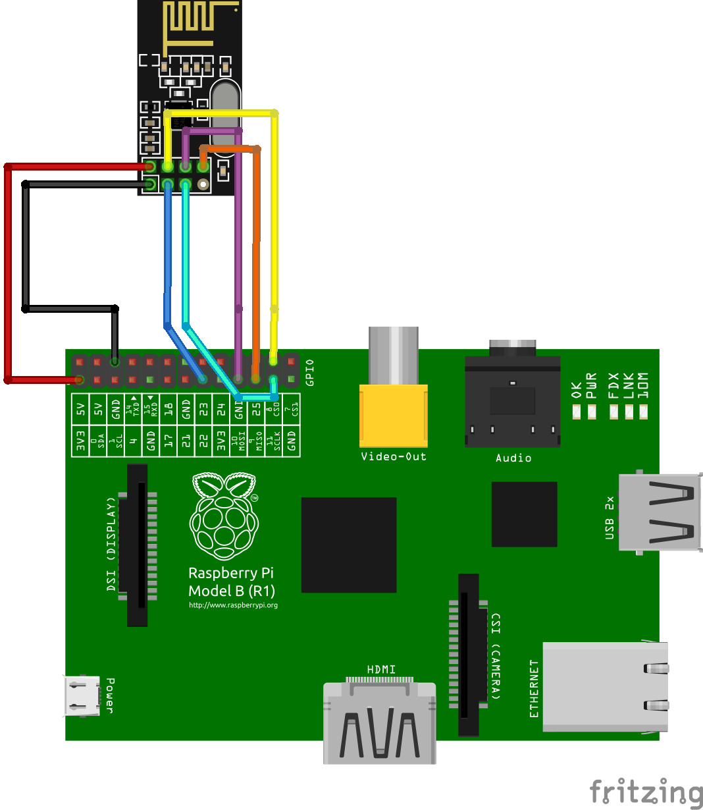

# Weather Base Station

The purpose of this project is to build a weather base station with Raspberry Pi that receives data from Arduino weather station, store these data on SQLite database, and expose these data through REST API written in Flask.

## Sensors
To build this project was used on an Raspberry PI B model 1 with the following sensors:

NRF24l01 - Wireless transceiver module used to receive the collected data by Arduino Weather Station.

## Libraries
In the present project, the following libraries were used:

**pyRF24 by TMRh20**: Necessary library to use the NRF24l01 sensor on Pyhton 3 language;
**pyRF24Network by TMRh20**: Necessary library to create a sensor network using the NRF24l01 transceiver on Pyhton 3 language;

The libraries listed above must be compiled to Raspberry Pi. Follow this [documentation](http://google.com) to compile these libraries on Raspberry Pi.


## Electrical Schematic
The figure bellow show as the phisical sensors must be connected on Raspberry Pi:



## Run the project
To run, you need the Python 3 installed on Raspberry Pi and install the **New Relic Python Agent**. First it's necessary create a account on [New Relic](https://newrelic.com/) and follow the [New Relic instructions](https://docs.newrelic.com/docs/agents/python-agent/installation/standard-python-agent-install). The file **newrelic.ini** must be in the same folder of *weather_base_station.py* or you can create the environment variable *NEW_RELIC_CONFIG_FILE* pointing to **newrelic.ini** location. See the bellow example:

```bash
#You must create the New Relic account first
$ pip3 install newrelic
$ newrelic-admin generate-config <YOUR_LICENSE_KEY> newrelic.ini
$ export NEW_RELIC_CONFIG_FILE=<YOUR_NEWRELIC.INI_FILE_PATH>
$ chmod 755 weather_base_station.py
$ newrelic-admin run-program weather_base_station.py
```

## Related Projects

This project only receive the aquired data from Arduino Station and tore it on SQLite database and expose it on RESP API. A Arduino Station was developed to collect the data and a dashboard was also built in HTML5, CSS3, and JS that displays this data to the user by consuming a REST API exposed by this base station. For more details of the base station project or dashboard project, visit:

* [Arduino Weather Station](https://github.com/profbrunolopes/weather-arduino-sensor)
* [Weather Station Dashboard](https://github.com/profbrunolopes/weather-dashboard)
